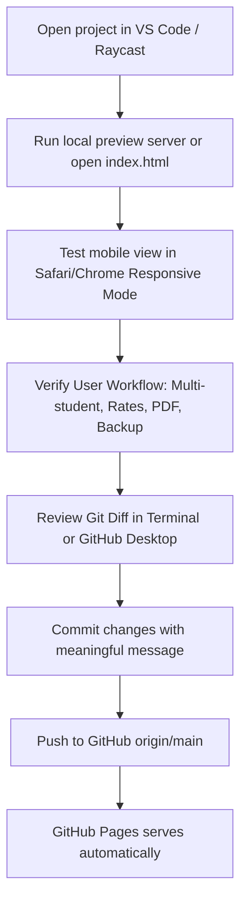

# macOS Development Workflow Guide

This guide outlines the development, testing, and deployment workflow for the **Private Tutoring Tracker** project using curated macOS tools from [awesome-mac](https://github.com/jaywcjlove/awesome-mac).

---

## 1. Project Profile & Tooling Strategy

- **Project Nature**: Pure static HTML5 / CSS3 / ES6 Single Page App with LocalStorage & PWA support.
- **Build Engine**: Zero-build runtime. No Node.js build step or bundler is required for production.
- **Hosting**: GitHub Pages (`https://mrhishamfadil.github.io/tutoring-tracker/`).
- **Data Model**: Local-first (`localStorage`) with JSON backup/restore and client-side jsPDF rendering.

---

## 2. Recommended macOS Tools from `awesome-mac`

| Tool | Category | Primary Purpose for this Project | Integration Type |
|---|---|---|---|
| **Visual Studio Code** | Code Editor | Editing HTML, CSS, JS, Markdown, Git diff view, Live Server extension | Direct Code & Git |
| **iTerm2** / **macOS Terminal** | Terminal | Git operations, local HTTP testing (`python3 -m http.server`), remote repository checks | Direct CLI & Git |
| **GitHub Desktop** | Git Client | Visual staging, inspecting unstaged diffs, branch management without CLI memorization | Direct Git Tool |
| **Raycast** | Launcher / Productivity | One-keystroke launch for repo in browser, opening project folder, clipboard manager | Runs alongside Antigravity |
| **Shottr** / **CleanShot X** | Screenshot & Annotation | Capturing pixel-accurate mobile/desktop screenshots, adding annotations for parents or design checks | Runs alongside Antigravity |
| **Safari / Chrome** | Browser & Testing | Testing Web Inspector, responsive design mode (iPhone viewports), offline service testing | Direct Testing |
| **OBS Studio** | Screen Recording | *(Optional)* Recording animated screen walkthroughs or explainer tutorials for parents | Runs alongside Antigravity |

---

## 3. Tool Classification: Direct vs. Alongside

### A. Tools that Integrate Directly with Coding and Git
1. **VS Code**:
   - Install the **Live Server** extension to preview edits in real time at `http://localhost:5500`.
   - Built-in Git source control tab lets you review exact line changes before staging.
2. **Terminal / iTerm2**:
   - Execute lightweight inspection commands:
     ```bash
     git status
     git diff
     ```
3. **GitHub Desktop**:
   - Useful for side-by-side graphical diffing before approving pushes.

### B. Tools that Run Alongside Antigravity (Companion / Productivity)
1. **Raycast**:
   - Create custom quick links:
     - Project folder: `~/Documents/Business_&_Feasibility/Private Tutoring Tracking`
     - GitHub Repo: `https://github.com/MrHishamFadil/tutoring-tracker`
     - GitHub Pages Settings: `https://github.com/MrHishamFadil/tutoring-tracker/settings/pages`
     - Live App: `https://mrhishamfadil.github.io/tutoring-tracker/`
2. **Shottr / CleanShot X**:
   - Instant capture of PDF preview or mobile viewport tests to inspect margin clipping and font legibility.
3. **Safari Responsive Design Mode** (`Cmd + Option + R`):
   - Switch between iPhone 15 Pro, iPad mini, and MacBook viewports directly within Safari.

---

## 4. Tools That Should NOT Be Installed (Unnecessary for this Project)

To prevent bloat and unnecessary background daemons, avoid installing:
- **TablePlus / DBeaver / Postico**: This project has no SQL/PostgreSQL database; all data lives in browser `localStorage`.
- **Docker / OrbStack**: Unnecessary for static single-file frontend sites.
- **Node Version Managers (nvm / fnm)**: Not required because there is no webpack/vite build pipeline.
- **Heavy IDEs (Xcode, Android Studio)**: Not needed; the app runs as a Progressive Web App (PWA) via Safari / WebKit.

---

## 5. Practical Daily Workflow: Edit, Test, Verify, Commit & Deploy



### Step-by-Step Commands:

1. **Local Preview**:
   ```bash
   # From project directory
   python3 -m http.server 8000
   # Open http://localhost:8000 in browser
   ```
2. **Review Changes**:
   ```bash
   git status
   git diff
   ```
3. **Stage and Commit**:
   ```bash
   git add -A
   git commit -m "Update session tracking and PDF export"
   ```
4. **Deploy**:
   ```bash
   git push origin main
   ```
   *GitHub Pages reflects the update automatically within ~30 seconds.*
